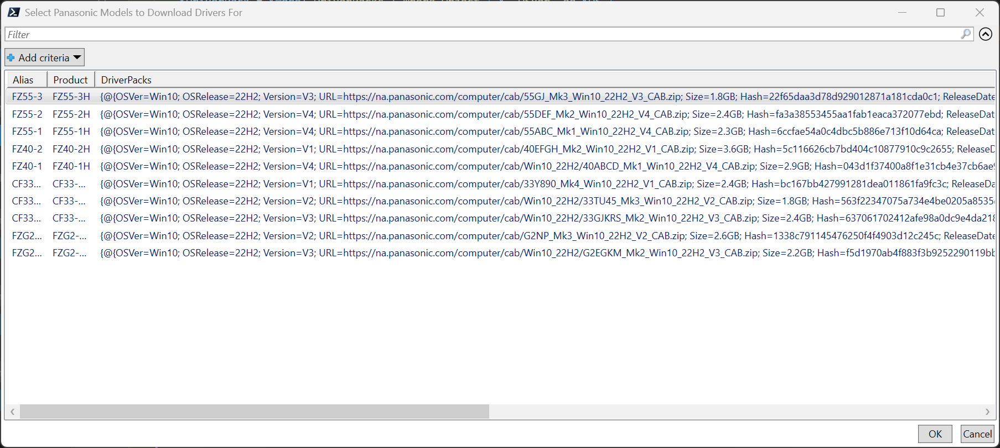
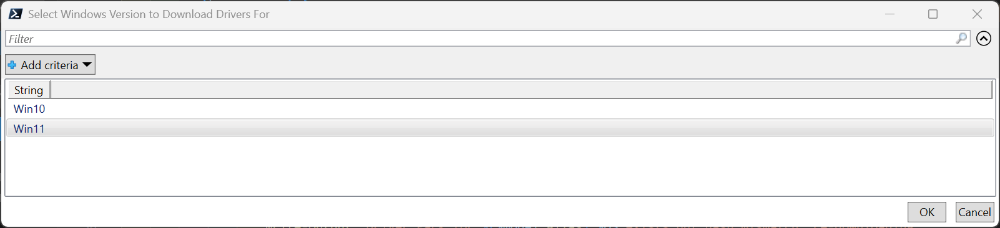
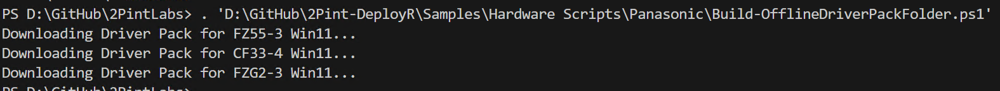
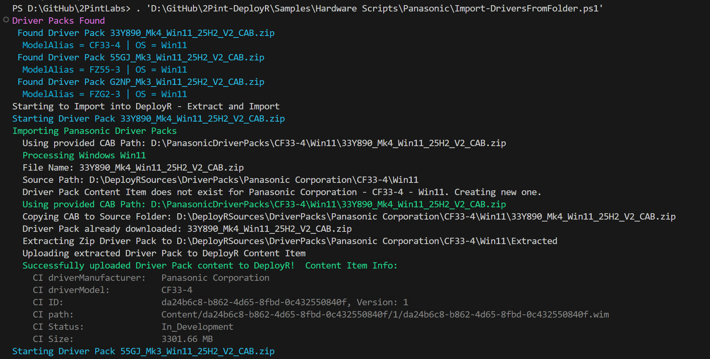
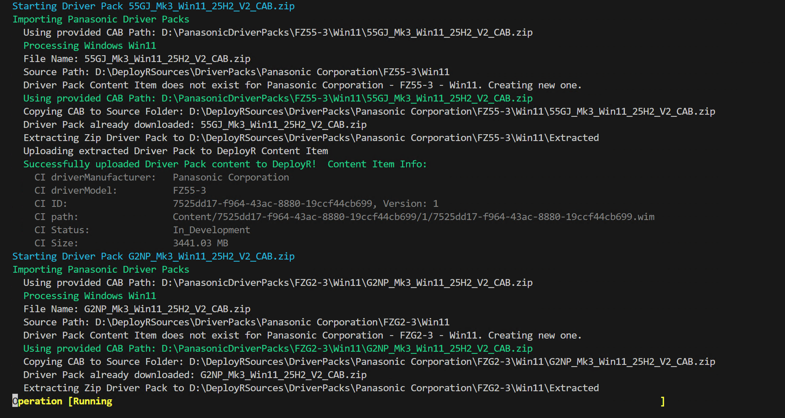
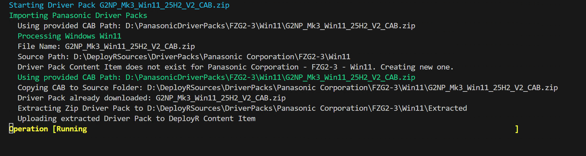
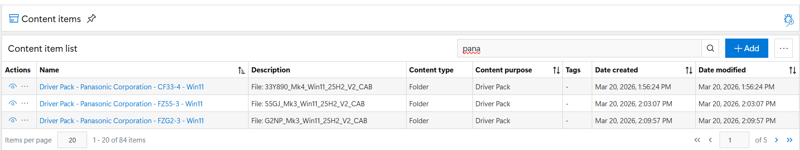
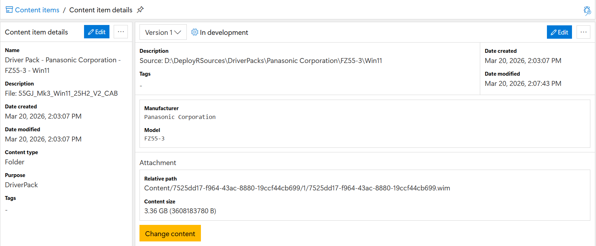

# Panasonic Offline Driver Sync

This process was created for the ability to easily go onto any machine, build a repository of Panasonic driver packs, then copy that folder via Flash Drive / Network Share, and place it somewhere the DeployR Server has access too.

## Build-OfflineDriverPackFolder.ps1

This script will use the Panasonic Online Catalog information to prompt you for the models you want to support, then if you want Win10 or Win11.  Once you have made your selections, it will go ahead and download them to the path you specify.

Make sure you set $BuildFolderPath to where you want the content downloaded

# Import-DriversFromFolder.ps1

This script will take the output from the last script, and import it into DeployR.

Set these two variables:

- $BuildFolderPath = "D:\PanasonicDriverPacks" (Wherever you copied them to or made them availble via Flash Drive, etc)
- $DeployRSourcesPath = "D:\DeployRSources\DriverPacks" (This is where you keep your Driver Pack sources for DeployR)

Then once you set that, run the script

