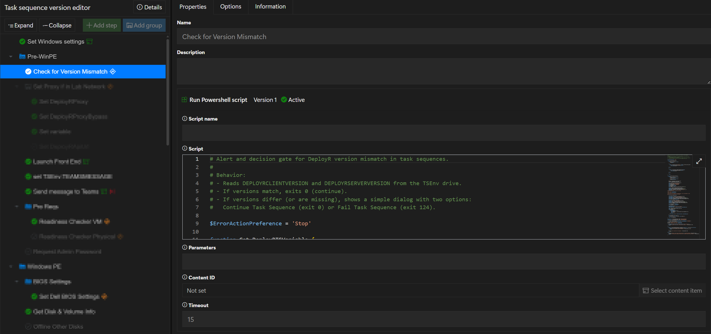
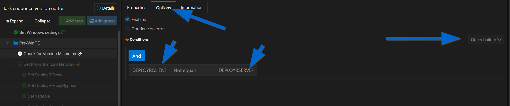
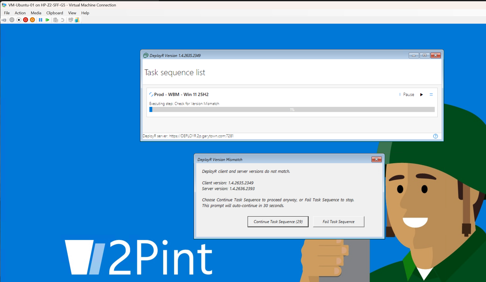

# Alert-ClientServerVersionMismatch

This script is a task-sequence safety gate for DeployR version mismatches.

## What It Does

1. Reads these task-sequence variables:
1. DEPLOYRCLIENTVERSION
1. DEPLOYRSERVERVERSION
1. If both are set and match, it exits with code 0 and the task sequence continues.
1. If they do not match (or one is missing), it shows a popup dialog that includes:
1. Client version and server version values.
1. Continue Task Sequence button.
1. Fail Task Sequence button.
1. 30-second auto-continue countdown.

## Exit Codes

1. 0: Continue task sequence.
1. 124: Fail task sequence (when Fail Task Sequence is selected).

## Dialog Behavior

1. Continue Task Sequence returns exit code 0.
1. Fail Task Sequence returns exit code 124.
1. If no user action occurs, the dialog auto-selects Continue after 30 seconds and returns exit code 0.
1. If the dialog cannot be displayed, the script defaults to continue (exit code 0).

## Sample Usage

Use this as a DeployR task-sequence PowerShell step to let an operator decide whether to proceed when client and server versions differ.

## Task Sequence Setup

Add a "Run PowerShell" step into the squence and paste the script:

Under the option tab, for the condition, set the Query Builder to:

DEPLOYRCLIENTVERSION Not Equals DEPLOYRSERVERVERSION

## Example Screenshot

