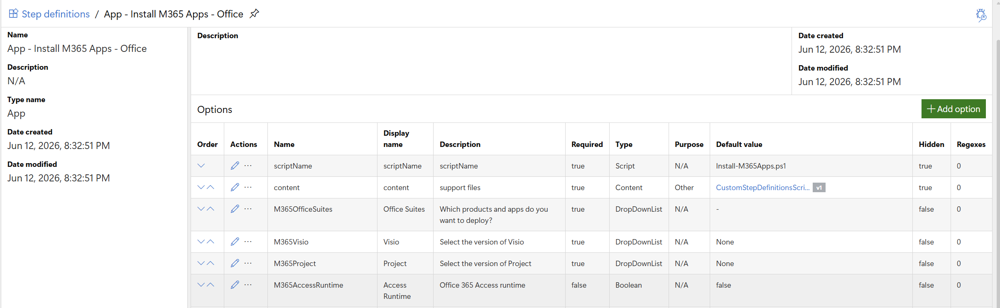

# DeployR Custom Step Definitions

These are step definitions samples which you are welcome to import into your DeployR environment.

These steps are two parts, a JSON file which gets imported into DeployR as shown below, and a PowerShell script which you'll need to create a content item for.

The step defintion(s), once imported, you'll want to go into them then update the content item to the one you created.

## Instructions to Import

### Download and Import Step Definition

- Download the Associated JSON file from this folder
- Use PowerShell 7 on the DeployR Server to load module and connect to DeployR service: [Docs](https://documentation.2pintsoftware.com/deployr/powershell-modules/scripting-for-deployr-server)
- Run the Import Command to import the json file you downloaded

```PowerShell
Import-DeployRStepDefinition -SourceFile "C:\Users\gary.blok\Downloads\753771ea-0a3b-4e34-9931-301e0971c3c3.json"
```

### Download and Create Content Item

Grab all the scripts (or the ones needed for the steps you're wanting to import) and create a DeployR content item.  


### Update Step Definition to use the Content Item

Once you have the the step definition imported and createed the content item, you can set the content item with the scripts in the step definition.




You can read more on my blog: https://garytown.com/deployr-importing-custom-step-definitions

