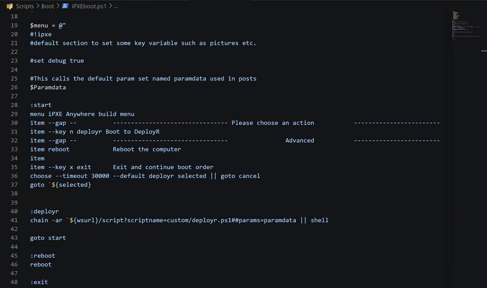
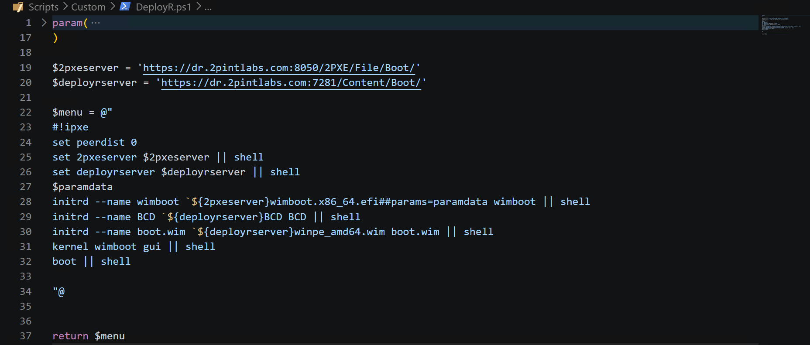

# DeployR + iPXE Web Service Integration

DeployR Enterprise includes iPXE Anywhere, which includes two components, 2PXE Server which is your iPXE responder and iPXE Web Service, which takes 2PXE and adds the ability to "Easily" build custom menus, support 802.1X and basically allow any customization you can imagine.  In this GitHub section, we'll cover a few basics of updating the default iPXE PowerShell scripts for DeployR to add additional menus entries, and the ability to automatically start a specific task sequence automatically when launched from the iPXE Menu.

Just a reminder, this is only for DeployR Enterprise

> [!NOTE]
> iPXE (Both 2PXE Server and iPXE Anywhere Web Service) must be installed on the same server as DeployR.

## Default iPXE Setup for DeployR

Today, as of DeployR  version 1.1, DeployR will automatically place the boot images into the 2PXE Remoteinstall folder when being generated, ex: C:\ProgramData\2Pint Software\2PXE\Remoteinstall\Sources\DeployR_x64

iPXE Web Service will keep all of the scripts used in the Menu booting process in scripts folder: C:\Program Files\2Pint Software\iPXE AnywhereWS\Scripts

The scripts are kept on the 2Pint Software iPXE GitHub: https://github.com/2pintsoftware/2Pint-iPXEAnywhere/tree/main/Scripts

When you follow the videos, it provides information about how to setup the process for DeployR, in a nutshell, replacing the Boot\iPXEBoot.ps1 file with the DeployR version, then updating the Custom\DeployR.ps1 with your service information.

Your Default iPXE ipxeboot.ps1 file should look like this:

The DeployR Boot Menu Entry line (31) will the trigger the chain on line 41, which will load the custom/deployr.ps1 powershell file:

